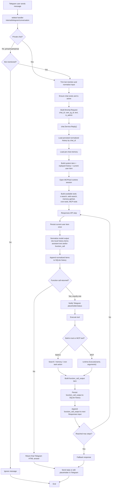
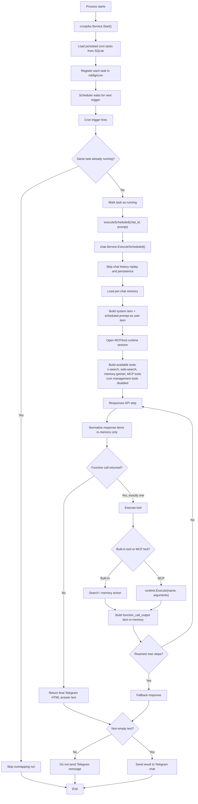

<p align="center">
  
</p>

<h1 align="center">Mangoduck</h1>

<p align="center">
  Agentic Telegram bot for private chats and group chats, with OpenAI Responses API, search tools, MCP integration, chat-scoped memory, and scheduled tasks.
</p>

> [!WARNING]
> This project is provided for research and experimental purposes only. It may contain critical bugs, security flaws, or other defects, and you run, use, deploy, and rely on it entirely at your own risk.

## Overview

Mangoduck is a Go Telegram bot built for a single user or small teams that collaborate in Telegram chats. It keeps access control simple: every conversation target is treated as a Telegram `chat`, and access is granted or denied only by `chat_id`.

Admin privileges are not stored in the database. They are derived directly from `config.yaml` under `admin.tg_ids`; every other user is treated as a regular user.

The bot runs in an agentic loop on top of the Responses API, can call built-in tools such as web search and memory management, and can expose external MCP tools during a chat turn. It stores normalized conversation items locally in SQLite and replays them per `chat_id` on each request, while keeping the provider side stateless for the main chat flow.

## Features

- Agentic Telegram chat flow with OpenAI-compatible Responses API.
- Works in private chats, groups, and supergroups.
- Mentions-only behavior in group chats to avoid noise.
- Chat-level access control managed by admins via `/chats`.
- Local SQLite persistence for chat history, per-chat memory, and cron tasks.
- Built-in tools for `x-search`, `web-search`, `memory-get`, `memory-set`, `list-cron-tasks`, `add-cron-task`, and `delete-cron-task`.
- Optional MCP integration for both `streamable_http` and local `stdio` servers.
- Startup preflight that validates the main Responses API and, when enabled, the xAI search API, the OpenAI web search API, and enabled MCP servers before polling starts.
- Scheduled prompts executed in the same agentic mode without replaying chat history.
- Sanitized runtime errors are reported back into Telegram chats without exposing credentials.

## How It Works

1. A Telegram update arrives.
2. The bot resolves the current Telegram `chat_id` and creates or refreshes a local chat record.
3. In groups and supergroups, the bot replies only if the message mentions the bot.
4. If the chat is inactive, the bot asks for approval and shows the chat ID.
5. When an admin activates a chat through `/chats`, the bot sends an approval message into that same Telegram chat.
6. If the chat is active, the bot replays locally stored normalized Responses items for that `chat_id`, injects per-chat memory, and sends a fresh stateless request to the model.
7. The model may answer directly or call exactly one tool in a step.
8. Tool results are stored locally as normalized items and fed back into the next model step.
9. The final assistant response is sent back to the same Telegram chat as Telegram-compatible HTML.
10. If a handler fails, the bot logs the full error server-side and sends a sanitized error summary back to Telegram.

## Commands

### User commands

- `/start` creates or refreshes the current chat record, checks whether the chat is approved, and replies with `Hi!` when access is active.
- `/clear_context` removes the locally persisted chat context for the current chat.

### Admin commands

- `/chats` opens the chat management panel with activate/deactivate actions, and it works only in a private chat with the bot.
- Activating an inactive chat sends an approval message into that chat.

Admins are defined only in `config.yaml` under `admin.tg_ids`.

## Architecture

### Main pieces

- `cmd/mangoduck` starts the process, loads config, opens SQLite, and runs the bot.
- `internal/bot` wires Telegram, startup preflight, command sync, and runtime services.
- `internal/llm/chat` contains the main agentic chat loop and tool orchestration.
- `internal/llm/responses` wraps the Responses API client.
- `internal/llm/searchx` provides the xAI-backed X search tool, and `internal/llm/websearch` provides the direct OpenAI-backed web search tool.
- `internal/mcpbridge` exposes MCP tools to the model during a run.
- `internal/cronjobs` restores and executes scheduled prompts.
- `internal/repo` stores chats, normalized input/output items, and cron tasks.
- `internal/db` opens SQLite and applies embedded migrations on startup.

### User message flow



### Cron execution flow



### Persistence model

Mangoduck keeps the provider-side main chat flow stateless:

- It does not use `store=true`.
- It does not use `previous_response_id`.
- It stores only normalized `user text`, `assistant text`, `function_call`, and `function_call_output` items locally by Telegram `chat_id`.
- Scheduled cron runs execute without replaying chat history.

## Requirements

- Docker available locally.
- `make` available locally.
- Telegram bot token.
- API key for your configured Responses provider.
- OpenAI API key for `web-search`, if enabled.
- xAI API key for `x-search`, if enabled.

Go must be run only through the provided `Makefile` targets. Do not run `go` directly for project tasks, and use direct Docker commands only for the documented local gateway setup or the provided `make` targets.

## Quick Start

### 1. Start the local gateway

The example config expects a Portkey-compatible gateway on `http://127.0.0.1:8787`.

```bash
docker compose up -d
```

### 2. Create local config

Use the committed example config as the starting point:

```bash
cp config.yaml.dist config.yaml
```

Then fill in:

- `telegram.token`
- `admin.tg_ids`
- `responses.provider_api_key`
- `built_it_tools.web_search.api_key`, if you enable `web-search`
- `built_it_tools.x_search.api_key`, if you enable `x-search`
- any MCP server settings you want to enable

`config.yaml` is ignored by Git and should be treated as a secrets file.

### 3. Run the bot

```bash
make go CMD="run ./cmd/mangoduck"
```

On startup the bot will:

- load `config.yaml`
- open or create the SQLite database
- run embedded migrations
- validate the Responses API and, when enabled, the xAI API, the OpenAI web search API, and enabled MCP servers
- start Telegram polling

## Configuration

The safe example config lives in [`config.yaml.dist`](config.yaml.dist).

### Telegram

- `telegram.token`: bot token
- `telegram.poll_timeout`: polling timeout, default `10s`

### Admin

- `admin.tg_ids`: list of Telegram user IDs allowed to manage chats and cron tasks

### Database

- `database.path`: file-backed SQLite path or file-backed SQLite `file:` URI, default `mangoduck.db`

### Responses API

- `responses.base_url`: gateway or provider base URL
- `responses.provider`: provider name sent to the gateway
- `responses.provider_api_key`: API key for the configured provider
- `responses.model`: main model, for example `gpt-5-mini`
- `responses.timeout`: request timeout, default `30s`

### Built-in tools

`built_it_tools` groups configuration for the built-in search tools.

- `built_it_tools.web_search.api_key`: dedicated OpenAI API key for the `web-search` tool
- `built_it_tools.web_search.enabled`: enable or disable the `web-search` tool, default `true`
- `built_it_tools.web_search.base_url`: direct OpenAI base URL, default `https://api.openai.com`
- `built_it_tools.web_search.model`: web search model, default `gpt-5.4-nano`
- `built_it_tools.web_search.timeout`: request timeout, default `30s`
- `built_it_tools.x_search.api_key`: xAI API key
- `built_it_tools.x_search.enabled`: enable or disable the `x-search` tool, default `true`
- `built_it_tools.x_search.base_url`: xAI base URL
- `built_it_tools.x_search.model`: search model, for example `grok-4-1-fast-reasoning`
- `built_it_tools.x_search.timeout`: request timeout, default `30s`

### MCP

Each entry under `mcp.servers` can be enabled independently.

- `transport: streamable_http` for remote MCP servers
- `transport: stdio` for local MCP servers started per run

## Development

### Common commands

```bash
make fmt
make vet
make test
make build
make lint
```

### Arbitrary Go command

```bash
make go CMD="test ./internal/llm/chat -run TestName"
```

### Notes

- All Go commands must go through `make`.
- The Go module cache is mounted from `$(HOME)/go/pkg/mod`.
- `make` targets use Docker images defined in the [`Makefile`](Makefile).

## Chat Model

- Every Telegram conversation target is a `chat`.
- New chats are created as inactive.
- Access control is managed only per Telegram `chat_id`.
- Group and supergroup messages are handled only when the bot is explicitly mentioned.
- Per-chat memory is stored as a single free-form text block and injected into the system prompt when non-empty.

## Scheduled Tasks

Admins can list, create, and delete cron-backed prompts through the agent tools. Scheduled tasks:

- are persisted in SQLite
- are restored on startup
- run in the same agentic mode as regular chat
- do not replay prior chat history
- send the result back into the originating Telegram chat

## MCP Integration

Enabled MCP servers are opened for a single run, translated into Responses API function tools, and closed after the run finishes. Mangoduck supports:

- remote `streamable_http` servers
- local `stdio` servers

MCP tool names are exposed to the model with a server prefix such as `github__search_repositories`.

## Project Status

Mangoduck is structured like a small production-oriented bot service rather than a demo app. The repository already includes tests across config loading, bot behavior, repositories, chat orchestration, MCP bridging, cron jobs, and Telegram handlers.
